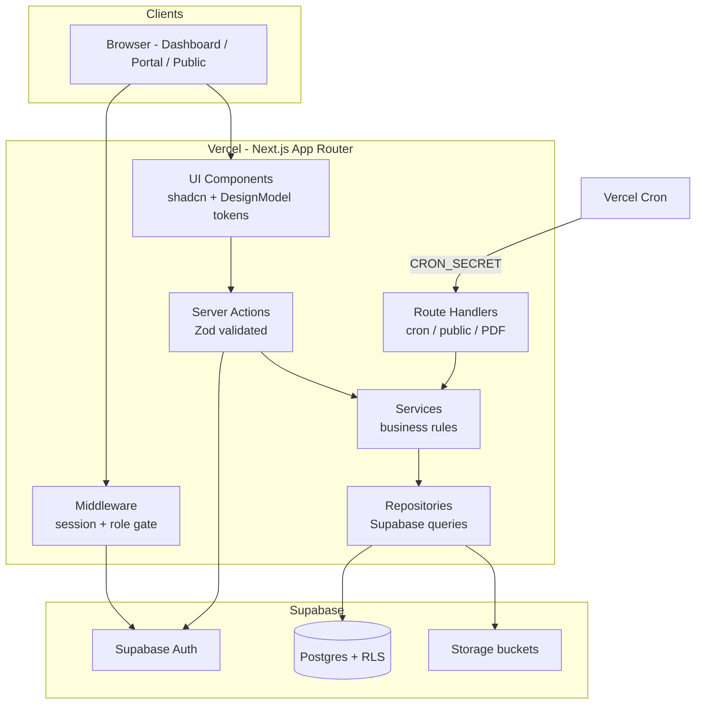
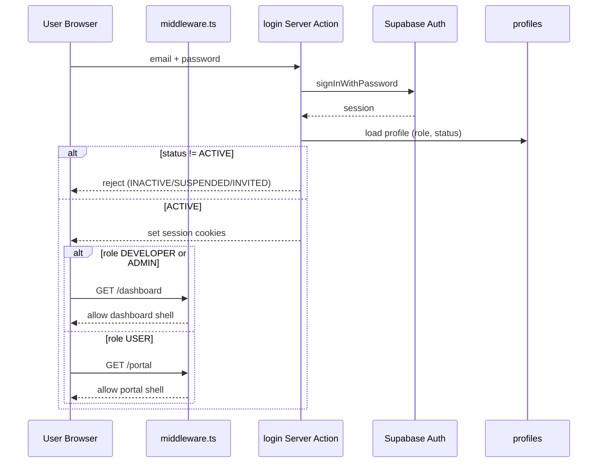
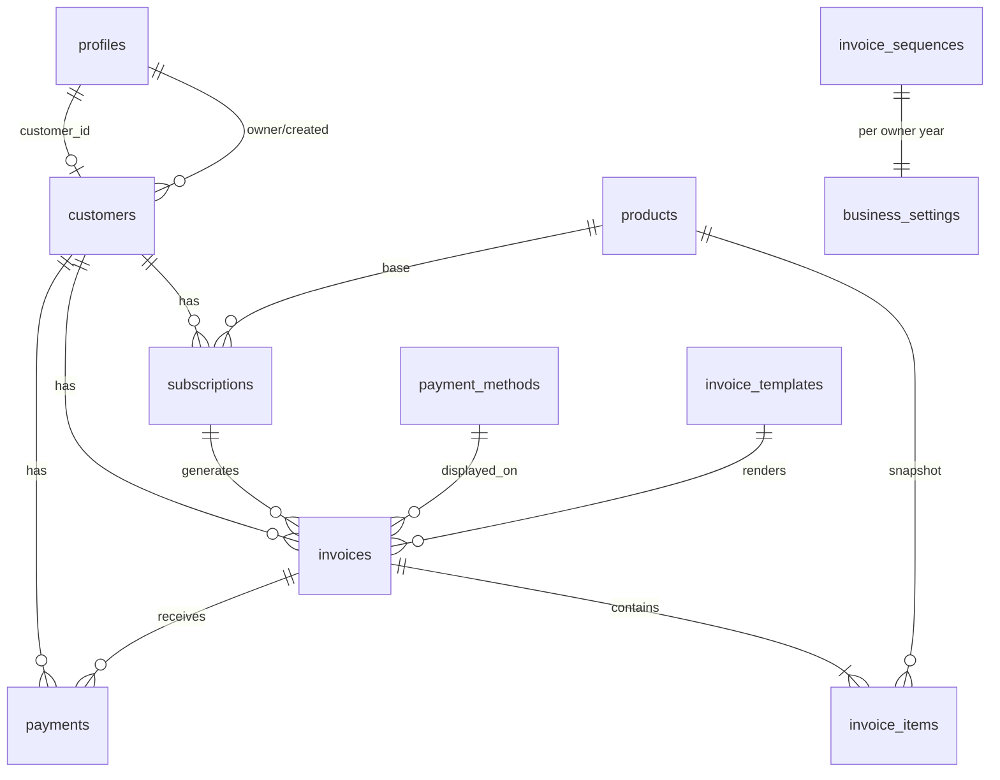
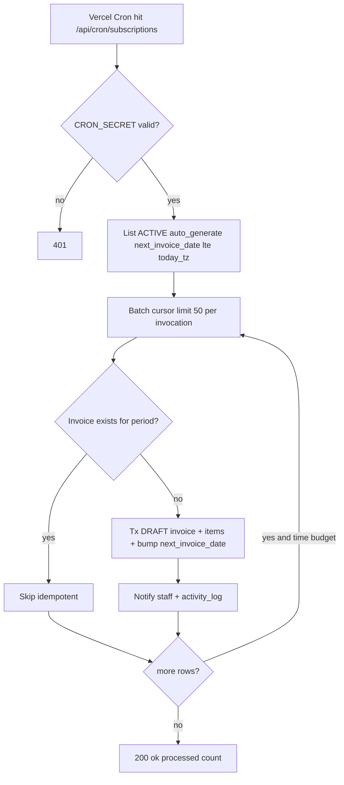
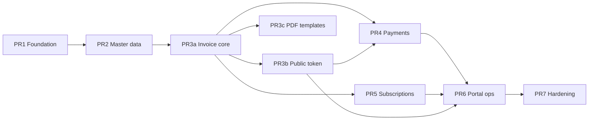

# F-INVOICE MVP — Full System Design

| Field | Value |
|-------|-------|
| **Title** | F-INVOICE MVP Full System Design |
| **Author** | Engineering (placeholder) |
| **Date** | 2026-07-31 |
| **Status** | Draft (Revision 2 — duplicate purge + status guard) |
| **Product** | Private Invoice Management System |
| **Workspace** | `/home/fahmiagent/Downloads/LAB GITHUB/LAB BETA/F-INVOICE` |
| **Sources** | `PRD/prdawal.txt`, `DesignModel/*` |
| **GitHub** | `git@github.com:kuker24/F-INVOICE.git` |

---

## Overview

F-INVOICE is a **private, invite-only** web application for one Developer-owner to manage customers, products/services, invoices, subscriptions, payments, PDF delivery, and a customer portal. It is **not** a public SaaS, marketplace, or multi-tenant product. Three roles exist: **Developer** (full control, single primary account), **Admin** (operational staff, no system secrets/settings mutation), **User** (customer portal, own data only).

This design specifies a greenfield build on **Next.js App Router + TypeScript + Tailwind + shadcn/ui + Supabase (Postgres/Auth/Storage/RLS) + Vercel**, with business logic in a strict `UI → Server Action/API → Service → Repository → Database` layering. Money is always **integer IDR (sen-free whole rupiah)**. UI theme is locked to **DesignModel light monochromatic** (Geist, canvas `#f5f5f5`, paper `#fff`, ink `#0a0a0a`, radius 18 interactive / 24 cards; ember `#e7000b` only for destructive + overdue), overriding PRD §16 dark/blue/emerald guidance.

Next step after approval: implement via ordered PR plan (Foundation first).

---

## Background & Motivation

### Current state

- Workspace contains only:
  - `PRD/prdawal.txt` (~2937 lines, full product + backend requirements)
  - `DesignModel/` (`DESIGN.md`, `theme.css`, `tokens.json`, `variables.css`)
- No application code, no git history yet, no Supabase project yet.

### Pain points this system solves

- Manual spreadsheet invoicing for project work, maintenance, hosting, and app subscriptions.
- No single source of truth for balances, payment proofs, or overdue status.
- Customers lack a controlled portal and public invoice link without exposing internal notes.
- Owner needs auditability and role separation (ops Admin vs customer User) without multi-tenant SaaS complexity.

### Constraints

- Single-business (one `owner_id` root), invite-only accounts, IDR-only MVP.
- No payment gateway, WhatsApp, accounting, multi-currency, or tax automation in MVP (PRD §4).

---

## Goals & Non-Goals

### Goals

1. Ship invite-only auth with role redirects (Developer/Admin → `/dashboard`, User → `/portal`).
2. Full CRUD/ops for customers, products, invoices, subscriptions, payments, business settings, payment methods, templates.
3. Server-side integer invoice math, status state machine, sequence numbering with row lock.
4. Public invoice page `/i/[token]` (token ≥ 32 chars), SENT→VIEWED, no internal notes.
5. PDF download for staff, portal user, and public token path.
6. Payment proof upload + verify/reject with automatic balance/status update.
7. Subscription draft generation via Vercel Cron (idempotent) + daily overdue marking.
8. RLS on all primary tables; service role never exposed to browser.
9. Activity logs + in-app notifications for operational events.
10. Deployable on Vercel with validated env vars and DesignModel UI.

### Non-Goals (MVP)

- Public registration, OAuth social login, multi-business, multi-currency.
- Automatic payment gateway / bank sync / e-meterai / tax invoice (faktur pajak).
- Mobile native apps, WhatsApp API, chat, marketplace templates.
- Complex tax engine; tax is a simple per-line rate stored as integer basis points or percent integer (see Data Model).
- Dark mode (explicitly overridden by DesignModel).

---

## Proposed Design

### High-level architecture



### Layering rules

| Layer | Location | Responsibility |
|-------|----------|----------------|
| UI | `src/components/**`, `src/app/**/page.tsx` | Presentation, RHF forms, TanStack Table; **no** money math, status transitions, or direct Supabase writes for sensitive ops |
| Server Action / Route Handler | `src/server/actions/**`, `src/app/api/**` | Auth context, Zod parse, map errors to `{ success, data \| error }` |
| Service | `src/server/services/**` | Invoice calc, status machine, sequence, payment balance, subscription generate, audit |
| Repository | `src/server/repositories/**` | SQL/Supabase client calls; no business branching beyond query shape |
| Database | Supabase Postgres | Constraints, indexes, RLS, transactions |

**Clients:**

- Browser uses **anon key** + user session (RLS enforced).
- Server Actions / Route Handlers use **user-scoped** Supabase client by default.
- **Service role** client only for: invite user creation, cron jobs, cross-RLS admin ops that are still re-checked in service layer, signed storage admin when required. Never imported into client bundles (`server-only` package).

### App Router structure

```text
src/app/
├── (auth)/
│   ├── login/page.tsx
│   ├── forgot-password/page.tsx
│   ├── reset-password/page.tsx
│   └── layout.tsx                 # minimal centered shell
├── (dashboard)/
│   ├── layout.tsx                 # sidebar + header; roles DEVELOPER | ADMIN
│   ├── dashboard/page.tsx
│   ├── customers/
│   ├── invoices/
│   ├── subscriptions/
│   ├── payments/
│   ├── products/
│   ├── users/
│   ├── templates/
│   ├── activity-log/
│   └── settings/
│       ├── business/
│       ├── payment-methods/
│       └── invoice-numbering/
├── (portal)/
│   ├── layout.tsx                 # User sidebar; role USER only
│   ├── portal/page.tsx
│   ├── portal/invoices/
│   ├── portal/subscriptions/
│   ├── portal/payments/
│   └── portal/profile/
├── api/
│   ├── cron/
│   │   ├── subscriptions/route.ts
│   │   └── overdue/route.ts
│   ├── public/invoices/[token]/
│   └── invoices/[id]/pdf/route.ts
├── i/[publicToken]/page.tsx       # public invoice (no auth layout)
├── layout.tsx
└── middleware.ts                  # session refresh + route guards
```

PRD §19 `src/` layout is authoritative; features may also live under `src/features/*` for colocated schemas/hooks, but **mutations always call Server Actions**.

### Design system integration

Copy DesignModel tokens into Tailwind/shadcn theme at Foundation:

| Token | Value | Usage |
|-------|-------|-------|
| `--color-canvas` | `#f5f5f5` | Page bg, secondary buttons, input rest |
| `--color-paper` | `#ffffff` | Cards, popovers |
| `--color-surface-alt` | `#fafafa` | Sidebar |
| `--color-ink` | `#0a0a0a` | Primary text; **primary filled button background** (label `#fafafa`) |
| `--color-ink-soft` | `#171717` | Solid badges only (not primary buttons) |
| `--color-mid-gray` | `#737373` | Muted text |
| `--color-hairline` | `#e5e5e5` | Borders |
| `--color-ember` | `#e7000b` | Destructive actions + error-adjacent **OVERDUE** only |
| Radius interactive | `18px` | buttons, inputs, badges |
| Radius cards | `24px` | cards |
| Font | Geist (weights 400/500/600) | all UI |

**Component recipes source of truth:** `DesignModel/DESIGN.md` sections Primary Filled Button, Card (hairline + shadow stack), Input, Badge variants, Destructive Action — implementers copy those recipes, not invent from the color table alone.

**Status badges:** achromatic solid/soft/outline only for DRAFT, SENT, VIEWED, PARTIALLY_PAID, PAID, CANCELLED. **OVERDUE** is treated as an **error-state exception** to DesignModel “ember not a status color”: ember text or outline allowed only for OVERDUE + destructive controls. Do **not** use PRD §16 blue/purple/orange/green status palette.

### Auth & session flow



**Rules:**

1. Supabase Auth: email/password + invite + password reset.
2. **Disable public signup** in Supabase dashboard + no signup UI.
3. **Invite transaction order (no circular FK deadlock):**
   1. If inviting a **User** portal account: ensure `customers` row exists first (create customer, or select existing). `customers.id` has no FK dependency on profiles.
   2. Supabase Auth `inviteUserByEmail` / `createUser` → yields `auth.users.id`.
   3. Insert `profiles` with `id = auth.users.id`, `status = INVITED`, `role`, and `customer_id` set when role=USER (FK → customers).
   4. On accept-invite / set-password success → `status = ACTIVE`, set `last_login_at` on first login.
   5. Admin invites never create `DEVELOPER` role.
4. Middleware:
   - Unauthenticated → `/login` for protected routes.
   - `DEVELOPER`/`ADMIN` hitting `/portal/**` → redirect `/dashboard`.
   - `USER` hitting `/(dashboard)/**` → redirect `/portal`.
   - Inactive/suspended → sign out + error.
5. Single primary Developer in MVP (enforce via seed + application check: cannot create second `DEVELOPER` role via Admin invite).

### Permission matrix (summary)

| Module | Developer | Admin | User |
|--------|-----------|-------|------|
| Business dashboard | Full (incl. revenue) | Ops metrics; **total revenue hidden when `business_settings.show_revenue_to_admin = false`** (default `true`) | No |
| Customer portal dashboard | N/A (use dashboard) | N/A | Own only |
| Customers | CRUD + soft + hard delete (`HAPUS`) | CRU + **soft archive/deactivate only** (set `deleted_at` / status); **no hard delete** | Own profile via portal |
| Products | CRUD + soft + hard | CRU + soft deactivate only; no hard delete | No |
| Invoices | Full CRUD + cancel + soft + hard | Create, edit DRAFT, send, cancel; **soft delete only**; no hard delete | Read own + public token |
| Subscriptions | Full | Ops CRUD (pause/resume/cancel); no system secrets | Read own |
| Payments | Full + **cancelPayment** + hard rules | Create + verify/reject + **cancelPayment** (PRD §10.18 Batalkan) | Submit PENDING + proof (portal **or** public token) |
| PDF | All | All invoices | Own + public token path |
| User management | Full (roles, activate) | Read limited (no role→Developer) | Own profile |
| Admin management | Full | No | No |
| Business settings | Full write | Read (no write); revenue flag visible read-only | No |
| Payment methods | Full write | Read | Via invoice / public DTO only |
| Invoice templates | Full write | Read | No |
| Activity log | All actions | **Operational subset only** (see RLS) | No |
| Permanent delete | Yes (type `HAPUS`) | No | No |

Enforcement triad: **UI hide + Service permission check + RLS**. UI hide alone is never security.

**Delete policy (locked):** Admin = soft deactivate/archive only. Developer = soft + permanent hard delete with confirmation typing `HAPUS`. Payments are not soft-deleted; use status `CANCELLED` + `cancelled_at` (PRD).

---

## Data Model

### Conventions

- PK: `uuid` default `gen_random_uuid()`.
- Timestamps: `timestamptz` `created_at`/`updated_at` (trigger on update).
- Money columns: `bigint` (IDR whole units). **Never** `float`/`numeric` for money.
- Soft delete: `deleted_at timestamptz null` where listed; list queries default `deleted_at is null`.
- `owner_id uuid not null` on business data → `profiles.id` of the Developer owner (single-business root). Admins operate under same `owner_id`.
- Enums as Postgres `CREATE TYPE` (preferred) or check constraints.

### Enums

```sql
create type user_role as enum ('DEVELOPER', 'ADMIN', 'USER');
create type account_status as enum ('ACTIVE', 'INACTIVE', 'SUSPENDED', 'INVITED');
create type customer_type as enum ('INDIVIDUAL', 'COMPANY', 'SCHOOL', 'OTHER');
create type customer_status as enum ('ACTIVE', 'INACTIVE', 'ARCHIVED');
create type product_status as enum ('ACTIVE', 'INACTIVE', 'ARCHIVED');
-- Product catalog cadence (PRD §10.10 Jenis Pembayaran)
create type billing_type as enum (
  'ONE_TIME',    -- Sekali bayar
  'MONTHLY',     -- Bulanan
  'QUARTERLY',   -- Tiga bulanan
  'SEMIANNUAL',  -- Enam bulanan
  'YEARLY',      -- Tahunan
  'CUSTOM'       -- Custom interval described in product notes / subscription
);
create type invoice_status as enum (
  'DRAFT', 'SENT', 'VIEWED', 'PARTIALLY_PAID', 'PAID', 'OVERDUE', 'CANCELLED'
);
-- PRD §10.12 Jenis invoice (no DEPOSIT in MVP)
create type invoice_type as enum (
  'PROJECT',       -- Project
  'SUBSCRIPTION',  -- Langganan
  'MAINTENANCE',   -- Maintenance
  'HOSTING',       -- Hosting
  'OTHER'          -- Layanan lain
);
create type subscription_status as enum ('ACTIVE', 'PAUSED', 'CANCELLED', 'EXPIRED');
-- PRD §10.17 Siklus langganan
create type billing_cycle as enum (
  'MONTHLY', 'QUARTERLY', 'SEMIANNUAL', 'YEARLY', 'CUSTOM'
);
create type payment_status as enum ('PENDING', 'VERIFIED', 'REJECTED', 'CANCELLED');
create type payment_method_type as enum ('BANK_TRANSFER', 'E_WALLET', 'CASH', 'OTHER');
create type record_status as enum ('ACTIVE', 'INACTIVE');
create type template_layout as enum ('MINIMAL', 'CORPORATE');
```

**UI labels (id-ID):** map enum → PRD copy exactly (`PROJECT`→Project, `SEMIANNUAL`→Enam bulanan, etc.).

**`product.billing_type` vs `subscription.billing_cycle`:**
- `billing_type` describes catalog default payment kind (includes `ONE_TIME`).
- `billing_cycle` is subscription recurrence only (no `ONE_TIME`).
- When creating a subscription from a product: if product is recurring cadence, default `billing_cycle` from product; if `ONE_TIME`, block subscription create or require explicit cycle override.
- Custom: product/subscription store interval days on subscription (`custom_interval_days`).

Tax rates: **integer basis points** (11% → `1100`). Line tax: half-up `(after_discount * bp + 5000) / 10000`. Header discount does **not** recompute tax base (locked; see golden examples).

### Tables (implementation-ready)

#### `profiles`

| Column | Type | Notes |
|--------|------|-------|
| id | uuid PK | = `auth.users.id` |
| full_name | text not null | |
| email | text not null unique | denormalized from auth |
| phone | text null | |
| avatar_url | text null | storage path or signed ref |
| role | user_role not null | |
| status | account_status not null default `INVITED` | |
| customer_id | uuid null FK → customers.id | required when role=USER |
| owner_id | uuid null FK → profiles.id | **ADMIN/USER:** Developer root id; **DEVELOPER:** null (self is root) |
| last_login_at | timestamptz null | |
| created_by | uuid null FK → profiles.id | |
| created_at | timestamptz not null default now() | |
| updated_at | timestamptz not null default now() | |

Indexes: `(role)`, `(status)`, `(customer_id)`, `(owner_id)`.

#### `business_settings`

| Column | Type | Notes |
|--------|------|-------|
| id | uuid PK | |
| owner_id | uuid not null unique FK profiles | one row per owner |
| business_name | text not null | |
| owner_name | text null | |
| tagline | text null | |
| logo_url | text null | |
| signature_url | text null | |
| signer_name | text null | |
| signer_title | text null | |
| email | text null | |
| phone | text null | |
| website | text null | |
| address | text null | |
| tax_number | text null | NPWP display only |
| default_currency | text not null default `'IDR'` | |
| timezone | text not null default `'Asia/Jakarta'` | |
| show_revenue_to_admin | boolean not null default true | PRD §10.5; when false Admin dashboard hides total revenue aggregates |
| created_at / updated_at | timestamptz | |

#### `customers`

| Column | Type | Notes |
|--------|------|-------|
| id | uuid PK | |
| owner_id | uuid not null | |
| customer_code | text not null | unique per owner |
| customer_type | customer_type not null | |
| name | text not null | |
| company_name | text null | |
| email | text null | |
| phone | text null | |
| secondary_phone | text null | |
| address / city / province / postal_code | text null | |
| tax_number | text null | |
| project_name | text null | |
| internal_notes | text null | **never** on public page |
| status | customer_status not null default `ACTIVE` | |
| created_by | uuid null | |
| created_at / updated_at | timestamptz | |
| deleted_at | timestamptz null | soft delete |

Indexes: unique `(owner_id, customer_code)`, `(owner_id, email)`, `(owner_id, status)`, partial where `deleted_at is null`.

#### `products`

| Column | Type | Notes |
|--------|------|-------|
| id | uuid PK | |
| owner_id | uuid not null | |
| code | text not null | unique per owner |
| name | text not null | |
| description | text null | |
| category | text null | |
| default_price | bigint not null check >= 0 | IDR |
| unit | text null | e.g. `pcs`, `bulan` |
| billing_type | billing_type not null | |
| default_tax_rate | integer not null default 0 | basis points |
| status | product_status not null default `ACTIVE` | |
| created_by | uuid null | |
| created_at / updated_at | | |
| deleted_at | timestamptz null | |

#### `invoices`

| Column | Type | Notes |
|--------|------|-------|
| id | uuid PK | |
| owner_id | uuid not null | |
| customer_id | uuid not null FK | |
| subscription_id | uuid null FK | set when from subscription |
| invoice_number | text not null | e.g. `FINV-2026-0001` |
| invoice_type | invoice_type not null default `PROJECT` | PRD §10.12 |
| issue_date | date not null | |
| due_date | date not null | |
| currency | text not null default `'IDR'` | |
| status | invoice_status not null default `DRAFT` | |
| subtotal | bigint not null default 0 | |
| discount_amount | bigint not null default 0 | invoice-level |
| tax_amount | bigint not null default 0 | sum of line taxes (+ any header tax if used) |
| additional_fee | bigint not null default 0 | |
| total_amount | bigint not null default 0 | |
| amount_paid | bigint not null default 0 | sum VERIFIED only |
| balance_due | bigint not null default 0 | |
| allow_partial_payment | boolean not null default true | |
| template_id | uuid null FK | |
| payment_method_id | uuid null FK | display on invoice |
| customer_notes | text null | public-safe |
| internal_notes | text null | staff only |
| terms | text null | |
| public_token | text not null unique | ≥32 chars cryptographically random |
| sent_at / viewed_at / paid_at / cancelled_at | timestamptz null | |
| created_by / updated_by | uuid null | |
| created_at / updated_at | | |
| deleted_at | timestamptz null | |
| subscription_period_start | date null | for idempotent subscription gen |
| subscription_period_end | date null | |

Unique: `(owner_id, invoice_number)`, `(public_token)`.  
Indexes: `(owner_id, status)`, `(customer_id)`, `(due_date)` where status in open states, `(subscription_id, subscription_period_start)`.

#### `invoice_items`

| Column | Type | Notes |
|--------|------|-------|
| id | uuid PK | |
| invoice_id | uuid not null FK on delete cascade | |
| product_id | uuid null FK | |
| position | integer not null | sort order |
| name | text not null | snapshot |
| description | text null | |
| quantity | integer not null check > 0 | **MVP integer only** (Key Decision); post-MVP may become `numeric(12,2)` with money still bigint |
| unit | text null | |
| unit_price | bigint not null | |
| discount_amount | bigint not null default 0 | per line |
| tax_rate | integer not null default 0 | bp |
| tax_amount | bigint not null default 0 | |
| line_total | bigint not null | |
| created_at / updated_at | | |

Index: `(invoice_id, position)`.

#### `subscriptions`

| Column | Type | Notes |
|--------|------|-------|
| id | uuid PK | |
| owner_id | uuid not null | |
| customer_id | uuid not null | |
| product_id | uuid null | |
| name | text not null | |
| description | text null | |
| billing_cycle | billing_cycle not null | |
| custom_interval_days | integer null | when CUSTOM |
| price | bigint not null | |
| currency | text not null default `'IDR'` | |
| start_date | date not null | |
| next_invoice_date | date not null | |
| end_date | date null | |
| due_days | integer not null default 7 | due_date = issue + due_days |
| auto_generate_invoice | boolean not null default true | |
| template_id | uuid null | |
| payment_method_id | uuid null | |
| status | subscription_status not null default `ACTIVE` | |
| internal_notes | text null | |
| created_by | uuid null | |
| created_at / updated_at | | |
| cancelled_at | timestamptz null | |

Indexes: `(status, next_invoice_date)` for cron, `(customer_id)`.

#### `payments`

| Column | Type | Notes |
|--------|------|-------|
| id | uuid PK | |
| owner_id | uuid not null | |
| invoice_id | uuid not null | |
| customer_id | uuid not null | |
| payment_number | text not null | unique per owner |
| amount | bigint not null check > 0 | |
| payment_date | date not null | |
| method | text null | free text or enum label |
| sender_name | text null | |
| reference_number | text null | |
| proof_url | text null | storage path |
| status | payment_status not null default `PENDING` | |
| notes | text null | |
| submitted_by | uuid null | profile id |
| verified_by | uuid null | |
| verified_at | timestamptz null | |
| rejection_reason | text null | |
| source | text not null default `'staff'` | check ∈ `staff`,`portal`,`public` |
| created_at / updated_at | | |
| cancelled_at | timestamptz null | |

Unique: `(owner_id, payment_number)`. Index: `(invoice_id, status)`. No soft-delete column; cancel via status. Hard-delete row: Developer-only rare path.

#### `payment_methods`

| Column | Type | Notes |
|--------|------|-------|
| id | uuid PK | |
| owner_id | uuid not null | |
| type | payment_method_type not null | |
| bank_name | text null | |
| account_number | text null | |
| account_holder | text null | |
| branch | text null | |
| instructions | text null | |
| is_default | boolean not null default false | one default per owner (partial unique) |
| status | record_status not null default `ACTIVE` | |
| created_at / updated_at | | |

#### `invoice_templates`

| Column | Type | Notes |
|--------|------|-------|
| id | uuid PK | |
| owner_id | uuid not null | |
| name | text not null | |
| slug | text not null | unique per owner |
| layout_type | template_layout not null | MINIMAL \| CORPORATE |
| accent_color | text null | PDF only; default ink |
| logo_position | text null | e.g. `left`/`center` |
| footer_text | text null | |
| show_signature | boolean not null default true | |
| is_default | boolean not null default false | |
| status | record_status not null default `ACTIVE` | |
| created_at / updated_at | | |

#### `notifications`

| Column | Type | Notes |
|--------|------|-------|
| id | uuid PK | |
| user_id | uuid not null FK profiles | recipient |
| type | text not null | e.g. `INVOICE_OVERDUE`, `PAYMENT_PENDING` |
| title | text not null | |
| message | text not null | |
| target_type | text null | `invoice`, `payment`, … |
| target_id | uuid null | |
| is_read | boolean not null default false | |
| created_at | timestamptz | |
| read_at | timestamptz null | |

Index: `(user_id, is_read, created_at desc)`.

#### `activity_logs`

| Column | Type | Notes |
|--------|------|-------|
| id | uuid PK | |
| owner_id | uuid not null | |
| actor_id | uuid null | null = system/cron |
| actor_role | text null | |
| action | text not null | e.g. `invoice.send` |
| entity_type | text not null | |
| entity_id | uuid null | |
| description | text not null | |
| old_values | jsonb null | |
| new_values | jsonb null | |
| ip_address | text null | |
| user_agent | text null | |
| created_at | timestamptz not null default now() | **immutable** — no update/delete policies for non-developer; Developer read-only in app (no UI edit) |

Indexes: `(owner_id, created_at desc)`, `(entity_type, entity_id)`.

#### `invoice_sequences`

Yearly counters only (MVP). Same table serves invoices and payments via `prefix` (`FINV` | `PAY`).

| Column | Type | Notes |
|--------|------|-------|
| id | uuid PK | |
| owner_id | uuid not null | |
| year | integer not null | calendar year in business timezone |
| prefix | text not null default `'FINV'` | `FINV` invoices; `PAY` payments |
| last_number | integer not null default 0 | |
| created_at / updated_at | | |

Unique: `(owner_id, year, prefix)`. **No `month` column** (yearly-only; avoids null-unique ambiguity).

### Entity relationship (logical)



### Migrations strategy

- Supabase CLI migrations under `supabase/migrations/`.
- **PR1:** enums + `profiles` + RLS helpers + basic policies + policy tests scaffold.
- **PR2 (mandatory):** `customers`, `products`, `business_settings`, `payment_methods`, `invoice_sequences`, **`activity_logs`**, **`notifications`** — so later services can write audit/notify without waiting for PR6 UI.
- **PR3+:** invoices domain, payments, subscriptions additive.
- No destructive renames without expand/contract.
- Seed script `supabase/seed.sql` for local/dev only (`developer@finvoice.local`, etc.) — **never** run on production.

### Export (PRD §10.11)

Invoice list **CSV export** is thin ops feature: ship in **PR6** (server query → CSV download for Dev/Admin). Not a separate data model. Excel/PDF bulk export post-MVP.

---

## RLS Policies

### Owner binding (locked)

- Business root: sole `profiles.role = 'DEVELOPER'` id is `owner_id` on all business tables.
- **Admin profiles store `profiles.owner_id uuid not null`** FK → Developer profile (add column on `profiles` for ADMIN/USER binding to business root; DEVELOPER has `owner_id = id` or null meaning self).
  - Migration: `profiles.owner_id uuid null references profiles(id)`; check: USER/ADMIN must set `owner_id` to Developer id; DEVELOPER `owner_id is null or owner_id = id`.
- Enforce at most one ACTIVE DEVELOPER via unique partial index or service guard on role assign.

```sql
-- profiles additions
alter table profiles add column owner_id uuid references profiles(id);
-- DEVELOPER: owner_id is null (self is root)
-- ADMIN/USER: owner_id = developer root id

create or replace function public.current_role()
returns user_role language sql stable security definer set search_path = public as $$
  select role from public.profiles where id = auth.uid();
$$;

create or replace function public.current_owner_id()
returns uuid language sql stable security definer set search_path = public as $$
  select case
    when role = 'DEVELOPER' then id
    else owner_id
  end from public.profiles where id = auth.uid();
$$;

create or replace function public.current_customer_id()
returns uuid language sql stable security definer set search_path = public as $$
  select customer_id from public.profiles where id = auth.uid();
$$;

create or replace function public.is_staff()
returns boolean language sql stable security definer set search_path = public as $$
  select role in ('DEVELOPER', 'ADMIN') and status = 'ACTIVE'
  from public.profiles where id = auth.uid();
$$;
```

If zero Developers or Admin.owner_id null → `current_owner_id()` null → all staff policies fail closed.

### Money / status column protection (locked)

User-scoped clients (**including Admin/Developer JWT**) **must not** UPDATE invoice money, **status**, payment-derived timestamps, or `public_token` directly. Those fields change **only** via security-definer RPCs or Server Actions that use the **service-role** repository after `assertRole` + transition maps.

**Staff client UPDATE may touch (DRAFT/content only):** `customer_notes`, `internal_notes`, `terms`, `issue_date`/`due_date` when status is DRAFT, `template_id`, `payment_method_id`, `allow_partial_payment`, `invoice_type`, soft `deleted_at` (Admin archive). Item lines: separate table policies / replace-on-save through service.

```sql
create or replace function public.enforce_invoice_update_guard()
returns trigger language plpgsql as $$
begin
  -- Service role / security definer RPCs set local config to bypass
  if current_setting('app.bypass_invoice_guard', true) = 'on' then
    return new;
  end if;

  -- Any authenticated non-bypass client (ADMIN and DEVELOPER user-scoped):
  if new.subtotal is distinct from old.subtotal
    or new.discount_amount is distinct from old.discount_amount
    or new.tax_amount is distinct from old.tax_amount
    or new.additional_fee is distinct from old.additional_fee
    or new.total_amount is distinct from old.total_amount
    or new.amount_paid is distinct from old.amount_paid
    or new.balance_due is distinct from old.balance_due
    or new.invoice_number is distinct from old.invoice_number
    or new.status is distinct from old.status
    or new.sent_at is distinct from old.sent_at
    or new.viewed_at is distinct from old.viewed_at
    or new.paid_at is distinct from old.paid_at
    or new.cancelled_at is distinct from old.cancelled_at
    or new.public_token is distinct from old.public_token
  then
    raise exception 'INVOICE_PROTECTED_FIELDS_CLIENT_UPDATE_FORBIDDEN';
  end if;
  return new;
end;
$$;

create trigger trg_invoice_update_guard
  before update on invoices
  for each row execute function public.enforce_invoice_update_guard();

-- Status / balance mutations ONLY via service role with bypass, e.g.:
-- perform set_config('app.bypass_invoice_guard', 'on', true);
-- inside rpc_send_invoice, rpc_cancel_invoice, rpc_mark_viewed,
-- rpc_verify_payment, rpc_cancel_payment, rpc_recompute_invoice_balance, cron overdue.
```

**Locked:** `sendInvoice`, public VIEWED, payment verify/cancel recompute, cron OVERDUE — all set `app.bypass_invoice_guard=on` in the same transaction (service role). Policy test: Admin client `UPDATE invoices SET status='PAID'` → fail; `sendInvoice` action → ok.

Same pattern on `payments`: **no UPDATE policy** for ADMIN/USER/DEVELOPER user-scoped clients. Staff mutations go through Server Actions using **service role** after Service-layer checks. SELECT still RLS-scoped.

### Concrete policies (implement in migrations)

```sql
alter table customers enable row level security;

-- DEVELOPER/ADMIN read same owner
create policy customers_staff_select on customers for select
  using (is_staff() and owner_id = current_owner_id());

create policy customers_staff_insert on customers for insert
  with check (is_staff() and owner_id = current_owner_id());

create policy customers_staff_update on customers for update
  using (is_staff() and owner_id = current_owner_id());

-- hard delete: DEVELOPER only
create policy customers_developer_delete on customers for delete
  using (current_role() = 'DEVELOPER' and owner_id = current_owner_id());

create policy customers_user_select on customers for select
  using (current_role() = 'USER' and id = current_customer_id());

-- invoices
create policy invoices_staff_select on invoices for select
  using (is_staff() and owner_id = current_owner_id() and deleted_at is null);
create policy invoices_staff_insert on invoices for insert
  with check (is_staff() and owner_id = current_owner_id());
-- staff update: content fields only; trigger blocks status/money/token/timestamps
create policy invoices_staff_update on invoices for update
  using (is_staff() and owner_id = current_owner_id());
-- status/money changes: service role + bypass only (no extra broad policy)
create policy invoices_developer_delete on invoices for delete
  using (current_role() = 'DEVELOPER' and owner_id = current_owner_id());
create policy invoices_user_select on invoices for select
  using (current_role() = 'USER' and customer_id = current_customer_id() and deleted_at is null);

-- payments: no anon policies
create policy payments_staff_select on payments for select
  using (is_staff() and owner_id = current_owner_id());
create policy payments_staff_insert on payments for insert
  with check (is_staff() and owner_id = current_owner_id());
-- staff UPDATE policy: omit for MVP; use service role in PaymentService
create policy payments_user_select on payments for select
  using (current_role() = 'USER' and customer_id = current_customer_id());
create policy payments_user_insert on payments for insert
  with check (
    current_role() = 'USER'
    and customer_id = current_customer_id()
    and status = 'PENDING'
    and source = 'portal'
    and submitted_by = auth.uid()
    and invoice_id in (
      select id from invoices
      where customer_id = current_customer_id()
        and status in ('SENT', 'VIEWED', 'PARTIALLY_PAID', 'OVERDUE')
        and deleted_at is null
    )
  );

-- profiles
create policy profiles_select_self on profiles for select using (id = auth.uid());
create policy profiles_select_staff on profiles for select
  using (
    is_staff() and (
      id = auth.uid()
      or (current_role() = 'DEVELOPER')
      or (current_role() = 'ADMIN' and role = 'USER' and owner_id = current_owner_id())
    )
  );
-- Admin may list USERs under same owner_id; may not select other ADMINs' secrets beyond basic fields (app projects columns).
create policy profiles_update_self on profiles for update
  using (id = auth.uid())
  with check (
    id = auth.uid()
    and role = (select role from profiles where id = auth.uid()) -- no self role change
    and status = (select status from profiles where id = auth.uid()) -- no self status change
  );
-- role/status changes: service role only after Developer permission

-- activity_logs
create policy activity_logs_developer_select on activity_logs for select
  using (current_role() = 'DEVELOPER' and owner_id = current_owner_id());
create policy activity_logs_admin_select on activity_logs for select
  using (
    current_role() = 'ADMIN' and owner_id = current_owner_id()
    and action not in (
      'settings.business.update',
      'settings.payment_method.update',
      'settings.payment_method.create',
      'user.role_change',
      'user.developer_action',
      'secrets.access'
    )
    and entity_type not in ('business_settings', 'invoice_sequences')
  );
-- INSERT: service role / security definer only (no client insert policy)
-- UPDATE/DELETE: none for all roles

-- notifications
create policy notifications_select_own on notifications for select using (user_id = auth.uid());
create policy notifications_update_own on notifications for update
  using (user_id = auth.uid()) with check (user_id = auth.uid());
```

### Activity log “operational subset” (Admin)

**Include:** `customer.*`, `invoice.*` (except internal_notes field dumps if oversized — still allow action), `subscription.*`, `payment.*`, `product.*`, login success/fail for self context, public.view.

**Exclude for Admin:** business settings changes, payment method mutations, role changes, developer-only user admin, sequence changes, raw secret access.

### Storage policies

| Bucket | Path convention | Policies |
|--------|-----------------|----------|
| `business-assets` | `{owner_id}/logo.*`, `{owner_id}/signature.*` | SELECT authenticated staff where folder = current_owner_id; INSERT/UPDATE DEVELOPER only; no anon |
| `payment-proofs` | `{owner_id}/{invoice_id}/{uuid}.ext` | Staff SELECT all under owner; USER SELECT/INSERT only if `invoice.customer_id = current_customer_id()`; **anon: no storage policy** — public confirm uses server upload with service role |
| `invoice-pdfs` | `{owner_id}/{invoice_number}.pdf` | Staff read; USER read if owns invoice; write service role only |
| `avatars` | `{user_id}/{uuid}` | user CRUD own prefix |

Public payment proof: Route Handler validates token → service role `storage.upload` to `payment-proofs/{owner_id}/{invoice_id}/{uuid}` → insert payment row service role. **Never** grant anon INSERT on `payments` or storage.

### Policy tests

- PR1: pgTAP or SQL scripts under `supabase/tests/rls/` — anonymous denied; user cannot read other customer invoice; admin cannot hard-delete; admin cannot patch `amount_paid` **or `status`** via client; `sendInvoice` service path succeeds.
- PR2–PR4: extend per table as migrated.
- CI optional in PR7; local `supabase test db` required before merge of RLS PRs.

### Public / service-role path

Unauthenticated traffic **never** relies on RLS grants. Route Handlers use service role with **token equality filter** and allowlist DTO projection only.

## Invoice Domain Logic

### Calculation (server-only, integer)

**Locked product rules:**
1. Tax computed **per line** on amount after **line** discount only.
2. Invoice-level (`header`) discount is applied **after** line taxes are summed — **tax base is not recomputed** after header discount (simple MVP; not full Indonesian multi-stage PPN engine).
3. `header.discount_amount` must be `>= 0` and `<= subtotal` or service throws `HEADER_DISCOUNT_EXCEEDS_SUBTOTAL`.
4. `additional_fee >= 0`.
5. Always recompute on create/update items in `InvoiceService`; never trust client totals.

```ts
// src/lib/money/invoice-math.ts — pure functions, unit-tested

/** tax_rate_bp: 1100 = 11% */
export function lineTaxAmount(afterDiscount: bigint, taxRateBp: number): bigint {
  // half-up to nearest rupiah
  return (afterDiscount * BigInt(taxRateBp) + 5000n) / 10000n;
}

export function computeLine(input: {
  quantity: number; // integer MVP
  unitPrice: bigint;
  discountAmount: bigint;
  taxRateBp: number;
}) {
  const gross = BigInt(input.quantity) * input.unitPrice;
  const afterDiscount = gross - input.discountAmount;
  if (afterDiscount < 0n) throw new Error('LINE_DISCOUNT_EXCEEDS_GROSS');
  const taxAmount = lineTaxAmount(afterDiscount, input.taxRateBp);
  const lineTotal = afterDiscount + taxAmount;
  return { gross, afterDiscount, taxAmount, lineTotal };
}

export function computeInvoiceTotals(
  lines: { afterDiscount: bigint; taxAmount: bigint }[],
  header: { discountAmount: bigint; additionalFee: bigint }
) {
  const subtotal = lines.reduce((s, l) => s + l.afterDiscount, 0n);
  if (header.discountAmount > subtotal) throw new Error('HEADER_DISCOUNT_EXCEEDS_SUBTOTAL');
  const taxAmount = lines.reduce((s, l) => s + l.taxAmount, 0n);
  const totalAmount =
    subtotal - header.discountAmount + taxAmount + header.additionalFee;
  if (totalAmount < 0n) throw new Error('TOTAL_NEGATIVE');
  return { subtotal, taxAmount, totalAmount };
}
```

#### Golden examples (basis points, half-up)

**Example A — single line 11% tax, no header discount**

| Field | Value |
|-------|-------|
| qty | 1 |
| unit_price | 1_500_000 |
| line discount | 0 |
| tax_rate_bp | 1100 (11%) |
| gross / after_discount | 1_500_000 |
| tax_amount | (1500000×1100+5000)/10000 = **165_000** |
| line_total | 1_665_000 |
| header discount / fee | 0 / 0 |
| **total_amount** | **1_665_000** |

**Example B — line discount + header discount (tax not reduced by header)**

| Field | Value |
|-------|-------|
| qty | 2 |
| unit_price | 100_000 |
| line discount | 20_000 → after_discount = 180_000 |
| tax_rate_bp | 1100 → tax = (180000×1100+5000)/10000 = **19_800** |
| subtotal (sum after_discount) | 180_000 |
| header discount | 30_000 |
| additional_fee | 5_000 |
| total | 180000 − 30000 + 19800 + 5000 = **174_800** |

**Example C — half-up boundary**

| after_discount | bp | raw | tax |
|----------------|-----|-----|-----|
| 100 | 1100 | 110000/10000 = 11.0 | 11 |
| 1 | 1100 | (1100+5000)/10000 = 0 | 0 |
| 5 | 1100 | (5500+5000)/10000 = 1 | 1 |

Property tests: non-negative totals; header discount ≤ subtotal; recomputing twice is idempotent; client-supplied total ignored.

### Balance rules (PRD §10.19)

```text
amount_paid = sum(payments.amount where status = VERIFIED)  -- CANCELLED/REJECTED/PENDING excluded
balance_due = max(0, total_amount - amount_paid)            -- never store negative
```

**Overpay (locked):**
- `allow_overpay` is **false** for MVP (no column required; constant in service).
- On **verify** or staff “save and verify”: if `current_verified_sum + this_payment.amount > total_amount` → reject with `PAYMENT_EXCEEDS_BALANCE` (do not clamp silently).
- Staff may still record amount equal to remaining `balance_due`.
- When `amount_paid === total_amount` → `PAID`. PRD `>=` collapses to `===` under no-overpay rule.
- Display and DB: `balance_due = max(0, total - paid)`.

### Status state machine

#### User / staff intentional transitions (`UserTransition`)

```text
DRAFT → SENT | CANCELLED
SENT → CANCELLED | (OVERDUE via cron only)
VIEWED → CANCELLED | (OVERDUE via cron)
PARTIALLY_PAID → CANCELLED | (OVERDUE via cron)
OVERDUE → CANCELLED
PAID → ∅ (no manual cancel invoice while paid)
CANCELLED → ∅
SENT|VIEWED → VIEWED is system/public only
```

```ts
const USER_TRANSITIONS: Record<InvoiceStatus, InvoiceStatus[]> = {
  DRAFT: ['SENT', 'CANCELLED'],
  SENT: ['CANCELLED'],
  VIEWED: ['CANCELLED'],
  PARTIALLY_PAID: ['CANCELLED'],
  OVERDUE: ['CANCELLED'],
  PAID: [],
  CANCELLED: [],
};
```

Send: `DRAFT → SENT` sets `sent_at`. Cancel invoice only if no VERIFIED payments (or Dev cancels payments first).

#### System transitions (`SystemTransition`) — payment service + cron + public view only

```ts
const SYSTEM_TRANSITIONS: Record<InvoiceStatus, InvoiceStatus[]> = {
  DRAFT: [],
  SENT: ['VIEWED', 'PARTIALLY_PAID', 'PAID', 'OVERDUE'],
  VIEWED: ['PARTIALLY_PAID', 'PAID', 'OVERDUE'],
  PARTIALLY_PAID: ['PAID', 'OVERDUE', 'PARTIALLY_PAID'], // recompute may stay
  OVERDUE: ['PARTIALLY_PAID', 'PAID', 'OVERDUE'],
  // Payment cancel may reopen PAID:
  PAID: ['PARTIALLY_PAID', 'OVERDUE', 'VIEWED', 'SENT'],
  CANCELLED: [],
};
```

`recomputeInvoicePaymentStatus(invoice)` after verify/cancel payment:

```text
if amount_paid == 0:
  if status was PAID | PARTIALLY_PAID | OVERDUE (payment-driven):
    if due_date < today_tz → OVERDUE
    else if viewed_at is not null → VIEWED
    else if sent_at is not null → SENT
    else keep DRAFT (should not have payments)
  clear paid_at
elif amount_paid < total_amount → PARTIALLY_PAID (clear paid_at)
elif amount_paid == total_amount → PAID (set paid_at)
```

Matches PRD: *Jika amount_paid = 0 → status sebelumnya* with deterministic restore from `sent_at`/`viewed_at`/`due_date` (not a free-form stack).

Cron overdue: only `SENT|VIEWED|PARTIALLY_PAID` → `OVERDUE` when `due_date < today` in business timezone.

### Payment verification side-effects (transaction)

1. `SELECT invoice FOR UPDATE`.
2. Assert payment PENDING (verify) or staff create path.
3. Overpay check.
4. Set payment VERIFIED + `verified_by`/`verified_at`.
5. Recompute `amount_paid`, `balance_due`, status via rules above.
6. Activity log + notify customer (if linked User) + already-notified staff on submit.

Reject payment: `REJECTED` + reason; **no** balance change.

### `cancelPayment` (PRD §10.18) — required action

**Who:** Developer **and** Admin (both may “Batalkan Pembayaran”). Hard-delete payment row: Developer only (rare; prefer CANCELLED).

```ts
// PaymentService.cancelPayment(paymentId, actor)
// 1. assertRole DEVELOPER | ADMIN
// 2. BEGIN; lock payment + invoice
// 3. Only VERIFIED or PENDING may cancel (REJECTED already terminal)
// 4. status = CANCELLED; cancelled_at = now()
// 5. recomputeInvoicePaymentStatus (may PAID → PARTIALLY_PAID|SENT|VIEWED|OVERDUE)
// 6. activity_log payment.cancel; notify opposite party
// 7. COMMIT
```

Server Action: `cancelPayment(id): ActionResult<Payment>`.

### Sequence numbering

Format: `FINV-{YEAR}-{SEQ}` zero-padded 4+ digits (`FINV-2026-0001`). Payments: `PAY-{YEAR}-{SEQ}` via same table `prefix='PAY'`.

```sql
select last_number from invoice_sequences
where owner_id = $1 and year = $2 and prefix = $3
for update;
-- insert row if missing; then increment
```

RPC `next_document_number(owner_id, prefix, year)` security definer. Numbers never reused.

**Locked sequence strategy:** row-lock table (not Postgres `SEQUENCE`) so prefix/year are multi-tenant-safe under single owner and easy reset per year.

### Public token page + DTO + payment confirmation

- Page route: `/i/[publicToken]`.
- Token: `crypto.randomBytes(24).toString('base64url')` (≥32 chars).
- Rate limit: **60 req/min/IP** in **PR3** (not deferred).
- **No anon RLS.** Service role only.

#### `PublicInvoiceDTO` allowlist (only these fields leave the server)

```ts
type PublicInvoiceDTO = {
  invoice_number: string;
  status: InvoiceStatus; // never DRAFT (404 if DRAFT/CANCELLED? CANCELLED may show "cancelled"; DRAFT always 404)
  issue_date: string;
  due_date: string;
  currency: 'IDR';
  subtotal: number; // serialized bigint
  discount_amount: number;
  tax_amount: number;
  additional_fee: number;
  total_amount: number;
  amount_paid: number;
  balance_due: number;
  customer_notes: string | null;
  terms: string | null;
  allow_partial_payment: boolean;
  business: {
    business_name: string;
    logo_url: string | null; // short-lived signed URL
    address: string | null;
    email: string | null;
    phone: string | null;
  };
  customer: {
    name: string;
    company_name: string | null;
    // no internal_notes, no tax_number unless needed — omit tax_number + address internals for privacy
  };
  items: Array<{
    position: number;
    name: string;
    description: string | null;
    quantity: number;
    unit: string | null;
    unit_price: number;
    discount_amount: number;
    tax_rate: number;
    tax_amount: number;
    line_total: number;
  }>;
  payment_method: {
    type: string;
    bank_name: string | null;
    account_number: string | null;
    account_holder: string | null;
    instructions: string | null;
  } | null;
  // explicit omissions: id internals optional — expose invoice public id only if needed for support
  // NEVER: internal_notes, owner_id, created_by, activity, other invoices, staff emails, cost fields
};
```

SQL: select only required columns; join customer name fields; join single `payment_method_id` row; join business_settings by owner_id.

#### VIEWED transition

- Prefer **once**: if `status === 'SENT'` and `viewed_at is null`, set VIEWED + `viewed_at` inside `getPublicInvoice`.
- Skip transition for known bot UAs (optional list: `bot|crawler|preview`) — still show invoice, no status flip.
- Idempotent: second open no-ops.
- Log `invoice.public_view` with **hashed token suffix** only (never full token in logs).

#### Dual payment confirmation paths

| Path | Entry | Auth | Handler |
|------|-------|------|---------|
| **A. Portal** | User logged in | Session USER | Server Action `submitPaymentConfirmation` → user-scoped insert RLS |
| **B. Public token** | `/i/[token]` form | None | `POST /api/public/invoices/[token]/payment-confirmation` |

**Path B detail (no open service-role write):**

```mermaid
sequenceDiagram
  participant C as Browser anon
  participant RH as POST public payment-confirmation
  participant RL as Rate limiter
  participant S as PublicPaymentService
  participant St as Storage service role
  participant DB as Postgres service role

  C->>RH: multipart amount, date, proof, sender...
  RH->>RL: 5/hour/invoice + 10/hour/IP proof
  RL-->>RH: allow/deny
  RH->>S: confirm(token, payload)
  S->>DB: select invoice by public_token only
  alt missing or status not in SENT VIEWED PARTIALLY_PAID OVERDUE
    S-->>C: 404 or INVOICE_NOT_OPEN (no PENDING on PAID/CANCELLED/DRAFT)
  end
  S->>S: Zod, MIME, size<=5MB, open-status check, overpay precheck vs balance
  S->>St: upload payment-proofs/{owner}/{invoiceId}/{uuid}
  S->>DB: insert payments PENDING source=public submitted_by=null proof_url
  S->>DB: notify all ACTIVE DEVELOPER+ADMIN; activity_log
  S-->>C: 200 success pending message
```

- **`source` is required** on every payment insert: `staff` | `portal` | `public` (column on `payments`, NOT NULL, default `staff`). Public path sets `source='public'`, `submitted_by=null`. Portal sets `source='portal'`, `submitted_by=auth.uid()`. Optional `metadata jsonb` for `{ ip }` only — not a substitute for `source`.
- RLS: **zero** anon policies on `payments`.
- Open-invoice rule (portal RLS + public service): only `SENT|VIEWED|PARTIALLY_PAID|OVERDUE`. Reject PAID/CANCELLED/DRAFT.
- Abuse: rate limits (PR4); generic errors; no CAPTCHA MVP (accepted risk with rate limits).

## Payments flow

```mermaid
sequenceDiagram
  participant Actor as User Staff or Anon
  participant Entry as Action or Public RH
  participant S as PaymentService
  participant St as Storage payment-proofs
  participant DB as Postgres

  alt Portal USER
    Actor->>Entry: submitPaymentConfirmation
    Entry->>S: create PENDING source=portal submitted_by=user
  else Public token
    Actor->>Entry: POST /api/public/invoices/token/payment-confirmation
    Entry->>S: token check + PENDING source=public submitted_by=null
  else Staff record
    Actor->>Entry: recordPayment
    Entry->>S: PENDING or VERIFIED in one tx
  end
  Entry->>St: server upload proof if any
  S->>DB: insert payment
  S->>DB: notify ACTIVE DEVELOPER+ADMIN

  Actor->>Entry: verifyPayment / rejectPayment / cancelPayment
  Entry->>S: staff assertRole
  S->>DB: lock invoice recompute status balance
  S->>DB: notify linked USER if any
```

### Server Actions / routes

```ts
recordPayment(input)           // staff; optional verifyImmediately
submitPaymentConfirmation(input) // authenticated USER (portal)
verifyPayment(id)
rejectPayment(id, reason)
cancelPayment(id)              // DEVELOPER | ADMIN — reverses VERIFIED impact
// Route Handler:
// POST /api/public/invoices/[token]/payment-confirmation
// GET  /api/public/invoices/[token]  // optional JSON; page may use server component + service
```

### Payment numbers (single lock)

**Only** table `invoice_sequences` with `prefix ∈ {'FINV','PAY'}`.  
Format `PAY-{YEAR}-{SEQ}` zero-padded. No second sequences table. No ULID fallback.

### payments.source column

| Column | Type | Notes |
|--------|------|-------|
| source | text not null default `'staff'` | check `staff` \| `portal` \| `public` |

### Notification fan-out (locked)

| Event | Recipients |
|-------|------------|
| Payment PENDING (portal/public/staff pending) | All `profiles` where `role in (DEVELOPER,ADMIN)` and `status=ACTIVE` and `owner_id` match (Developer: id = owner) |
| Payment VERIFIED / REJECTED | USER profile where `customer_id = invoice.customer_id` if any; else skip |
| Invoice OVERDUE | Staff set above + linked USER |
| Invoice SENT | linked USER if any |

No per-assignee model in MVP.

## Subscriptions & Cron

### Manual generate

Server Action `generateSubscriptionInvoice(subscriptionId)` — same core as cron for one id (DRAFT only; staff must send).

### Cron endpoints

Vercel Cron only (PRD lock). Schedules stored **in UTC** in `vercel.json`. Business-day boundaries computed in app using `business_settings.timezone` (default `Asia/Jakarta`).

| Path | UTC schedule | Local intent (WIB UTC+7) |
|------|--------------|---------------------------|
| `/api/cron/subscriptions` | `0 18 * * *` | 01:00 WIB daily |
| `/api/cron/overdue` | `0 19 * * *` | 02:00 WIB daily |

Example: run stamped `2026-01-01T18:00:00Z` uses business date `2026-01-02` in Asia/Jakarta for `next_invoice_date <= today` comparisons. **Do not** rely on Postgres `current_date` without setting session TZ — pass `today` from app (`date in timezone`).

Auth: `Authorization: Bearer ${CRON_SECRET}`.

```json
{
  "crons": [
    { "path": "/api/cron/subscriptions", "schedule": "0 18 * * *" },
    { "path": "/api/cron/overdue", "schedule": "0 19 * * *" }
  ]
}
```



Idempotency: unique partial index `(subscription_id, subscription_period_start)` where `subscription_id is not null`.

`next_invoice_date` advance:

| Cycle | Advance |
|-------|---------|
| MONTHLY | +1 month (calendar) |
| QUARTERLY | +3 months |
| SEMIANNUAL | +6 months |
| YEARLY | +1 year |
| CUSTOM | +`custom_interval_days` days |

### Overdue job

App computes `today` in business TZ. Update candidates in pages of **100**:

```text
status IN ('SENT','VIEWED','PARTIALLY_PAID')
AND due_date < today
AND deleted_at IS NULL
```

Per row: system transition → OVERDUE; notify staff + linked user; activity_log. Stop when nearing Vercel max duration (~10s hobby / 60s pro — use 50–100 row chunks; residual picks up next day).

### Serverless batching (locked)

- Default batch size: **50** subscriptions / **100** overdue invoices per run.
- Optional query `?cursor=` for manual re-drive (cron secret required).
- Each item own transaction so one failure does not poison batch; collect error counts in log.

## Storage

Canonical bucket rules and path policies live under **RLS → Storage policies**. Summary:

| Bucket | Access | Rules |
|--------|--------|-------|
| `business-assets` | private | Path `{owner_id}/…`; Developer write; staff read; signed URL |
| `payment-proofs` | private | Path `{owner_id}/{invoice_id}/{uuid}.ext`; portal USER via RLS; **public confirm = service role only**; MIME jpg/jpeg/png/pdf; max 5MB |
| `invoice-pdfs` | private | Server write; signed URL / stream download |
| `avatars` | private | `{user_id}/…` self only |

Signed URL TTL: 60–300s. No anon storage grants.

---

## PDF Strategy

### Decision: **`@react-pdf/renderer`**

| Option | Pros | Cons |
|--------|------|------|
| **@react-pdf/renderer (CHOSEN)** | Pure JS on Node/Vercel; component model; no Chromium; predictable layout; works in Route Handler | Limited CSS; custom fonts need register; not 1:1 HTML |
| HTML-to-PDF (Puppeteer/Playwright) | Pixel-perfect HTML/CSS | Heavy binary on serverless; cold start; ops pain on Vercel without external service |
| External API (e.g. Gotenberg) | Quality | Extra infra cost/latency; out of MVP private scope |

**Rationale:** MVP invoice layouts are structured (Minimal / Corporate). Serverless-friendly, no Chrome dependency, data stays in-process from Service layer. Map DesignModel ink/paper into PDF styles (print-friendly white paper, black text).

**Pipeline:**

1. `InvoicePdfService.buildDocument(invoiceId)` loads invoice+items+customer+business+payment_method (server).
2. Render `@react-pdf/renderer` → `Buffer`.
3. Optionally cache to `invoice-pdfs` bucket key `{invoice_number}-{customer_slug}.pdf`.
4. Route Handler streams PDF or returns signed URL.

Filename: `FINV-2026-0001-Nama-Pelanggan.pdf` (sanitize slug).

---

## API / Interface Changes

Primary: **Server Actions** under `src/server/actions/*`. Thin Route Handlers only for cron, public token JSON if needed, and PDF binary.

### Action result shape

```ts
type ActionResult<T> =
  | { success: true; data: T }
  | { success: false; error: { code: string; message: string } };
```

### Representative Server Actions (not exhaustive)

```ts
// invoices
createInvoice(input: CreateInvoiceInput): ActionResult<{ id: string }>
updateInvoiceDraft(id, input): ActionResult<Invoice>
sendInvoice(id): ActionResult<Invoice>
cancelInvoice(id): ActionResult<Invoice>
duplicateInvoice(id): ActionResult<{ id: string }>

// payments
recordPayment(input): ActionResult<Payment>
submitPaymentConfirmation(input): ActionResult<Payment> // USER portal
verifyPayment(id): ActionResult<Payment>
rejectPayment(id, reason): ActionResult<Payment>
cancelPayment(id): ActionResult<Payment> // DEVELOPER | ADMIN
// public (Route Handlers)
// GET  /api/public/invoices/:token
// POST /api/public/invoices/:token/payment-confirmation
// POST /api/public/invoices/:token/view  // optional explicit view; GET may also view once

// subscriptions
createSubscription(input): ActionResult<Subscription>
pauseSubscription(id): ActionResult<Subscription>
resumeSubscription(id): ActionResult<Subscription>
cancelSubscription(id): ActionResult<Subscription>
generateSubscriptionInvoice(id): ActionResult<{ invoiceId: string }>

// users
inviteUser(input): ActionResult<void>
activateUser(id) / deactivateUser(id)
```

Zod schemas in `src/lib/validation/*`. Permission checks in `src/lib/permissions/*` (e.g. `assertRole(['DEVELOPER','ADMIN'])`, `assertCanAccessInvoice(user, invoice)`).

### Env validation (PRD §18)

```ts
// src/config/env.ts
import { z } from 'zod';

const envSchema = z.object({
  NEXT_PUBLIC_APP_URL: z.string().url(),
  NEXT_PUBLIC_SUPABASE_URL: z.string().url(),
  NEXT_PUBLIC_SUPABASE_ANON_KEY: z.string().min(1),
  SUPABASE_SERVICE_ROLE_KEY: z.string().min(1),
  CRON_SECRET: z.string().min(16),
  // Used: HMAC for ephemeral /api/invoices/[id]/pdf?sig= download links (staff/portal/public)
  // when not using Supabase storage cache — signs invoiceId+exp
  PDF_SIGNING_SECRET: z.string().min(16),
  // Reserved MVP: not used for application crypto until field-level encryption ships.
  // Validated so prod checklist forces rotation-ready secret; no call sites encrypt yet.
  // Do not invent ad-hoc AES without a design addendum.
  APP_ENCRYPTION_KEY: z.string().min(32),
});

export const env = envSchema.parse({
  NEXT_PUBLIC_APP_URL: process.env.NEXT_PUBLIC_APP_URL,
  // ...
});
```

Fail fast at server startup / first import of server config. Client only receives `NEXT_PUBLIC_*`.

**Secret purposes (locked):**
- `CRON_SECRET` — authorize cron Route Handlers.
- `PDF_SIGNING_SECRET` — HMAC-SHA256 for time-limited PDF download URLs (`invoiceId`, `exp`, optional `token` for public). Verified in PDF route before stream; TTL ≤ 5 minutes.
- `APP_ENCRYPTION_KEY` — **reserved, unused in MVP code paths**; present for PRD §18 compliance and future account-number-at-rest encryption. No DIY crypto wrappers in MVP.

---

## Project structure (target)

```text
src/
├── app/                    # routes as above
├── components/
│   ├── ui/                 # shadcn
│   ├── dashboard/
│   ├── invoices/
│   ├── customers/
│   ├── subscriptions/
│   ├── payments/
│   └── layout/
├── features/               # optional colocation: schemas, columns, hooks
├── lib/
│   ├── supabase/           # browser.ts, server.ts, admin.ts (service role)
│   ├── auth/
│   ├── permissions/
│   ├── validation/
│   ├── pdf/
│   ├── money/
│   └── audit/
├── server/
│   ├── actions/
│   ├── queries/            # read models for RSC
│   ├── services/
│   └── repositories/
├── types/
└── config/                 # env, constants, navigation
supabase/
├── migrations/
└── seed.sql
```

---

## Alternatives Considered

### 1. Auth: Supabase Auth vs NextAuth/Auth.js

| | Supabase Auth (chosen) | Auth.js + Supabase adapter |
|--|------------------------|----------------------------|
| Fit | Native RLS `auth.uid()`, invite flows, storage | Extra session layer |
| Cost | One vendor | More glue code |
| Decision | **Supabase Auth** — PRD lock, fewer moving parts for RLS |

### 2. Data access: Server Actions vs tRPC vs pure REST

| | Server Actions (chosen) | tRPC | REST-only |
|--|-------------------------|------|-----------|
| DX with App Router | Excellent | Good, more deps | Verbose |
| Public/cron/PDF | Still need Route Handlers | Same | Consistent |
| Decision | **Server Actions primary + thin Route Handlers** per PRD |

### 3. PDF: @react-pdf vs HTML-to-PDF

Covered above — **@react-pdf/renderer** for serverless fit.

### 4. Multi-tenant schema vs single-owner_id

| | Single owner_id (chosen) | Full multi-tenant orgs |
|--|--------------------------|------------------------|
| MVP scope | Matches private single business | Overbuild |
| Decision | **owner_id pattern without org table** |

### 5. Money: integer bigint vs numeric(12,2)

| | bigint IDR (chosen) | numeric |
|--|---------------------|---------|
| Float bugs | Avoided | Safer than float but still decimal edge cases |
| PRD | Explicit integer | — |
| Decision | **bigint whole rupiah** |

### 6. Rate-limit store

| | In-memory / edge Map (chosen MVP) | Upstash Redis / Vercel KV |
|--|-----------------------------------|---------------------------|
| Ops | Zero infra; works on single lambda warm instance imperfectly | Accurate multi-instance |
| Fit | Private low-traffic MVP + IP keys | When abuse appears |
| Decision | **Sliding window in `src/lib/rate-limit` with optional Upstash env later**; document multi-instance best-effort on pure memory. If `UPSTASH_REDIS_REST_URL` set, use Redis backend without code fork in callers. |

### 7. Sequence: row-lock table vs Postgres SEQUENCE

| | `invoice_sequences` + FOR UPDATE (chosen) | `CREATE SEQUENCE` |
|--|-------------------------------------------|-------------------|
| Per-year / prefix | Natural | Need many sequences |
| Multi-prefix FINV/PAY | One table | Separate objects |
| Decision | **Row lock table** |

### 8. Cron host: Vercel vs Supabase pg_cron

| | Vercel Cron (chosen) | pg_cron |
|--|----------------------|---------|
| PRD | Explicit Vercel Cron | Not specified |
| Secrets | CRON_SECRET on HTTP | DB-internal |
| Decision | **Vercel Cron** — no pg_cron in MVP |

### 9. Public payment confirmation auth model

| | Service-role RH after token (chosen) | Anon RLS insert | Force login only |
|--|-------------------------------------|-----------------|------------------|
| PRD | Public POST payment-confirmation | Broad attack surface | Breaks §10.14 UX |
| Decision | **Token-gated service role; no anon RLS** |

---

## Security & Privacy Considerations

### Rate limits — ship with surface (not only PR7)

| Surface | Limit (PRD §13) | Ships in |
|---------|-----------------|----------|
| Login | 5 / 15 min / IP+email | **PR1** |
| Password reset | 3 / hour / email | **PR1** |
| Public invoice GET | 60 / min / IP | **PR3b** |
| Public payment confirmation | 5 / hour / invoice (+ IP cap 20/hour) | **PR4** |
| Proof upload (portal + public) | 10 / hour / actor-or-IP | **PR4** |
| Authenticated API general | soft 120 / min / user | PR7 expand |

Implementation: `src/lib/rate-limit` used by middleware (login) and route handlers. PR7 adds CSP/headers/E2E, not first public defense.

### Threat model (abridged)

| Threat | Severity | Mitigation |
|--------|----------|------------|
| IDOR on invoices/payments | High | RLS + service `assertCanAccess*`; never trust URL ids alone |
| Public token brute force | High | ≥32 crypto chars; rate limit 60/min; generic 404 |
| Public pay abuse / spam PENDING | High | Rate limit; service-role only; no anon RLS; staff can reject |
| Admin client patches `amount_paid` | High | No money UPDATE via user client; service RPCs + triggers |
| Privilege escalation Admin→Developer | High | Role change only DEVELOPER; cannot self-promote; RLS |
| Service role leak to client | Critical | `server-only`; env not `NEXT_PUBLIC_` |
| Service role over-fetch on public | High | `PublicInvoiceDTO` allowlist; column-limited SQL |
| Payment proof malware | Medium | MIME sniff, extension ignore, 5MB cap, private bucket, no execute |
| CSRF on Server Actions | Medium | Next.js action origin checks; SameSite cookies |
| Login brute force | Medium | Rate limit 5 / 15 min / IP+email (**PR1**) |
| Internal notes on public page | High | Allowlist DTO; tests |
| Bot marks VIEWED | Low | Optional bot UA skip; once-only viewed_at |
| Dependency XSS | Medium | sanitize displayed notes; React default escape |

### AuthN/AuthZ checklist

- Public signup disabled.
- Inactive/suspended cannot obtain session use.
- Confirmation dialogs for destructive ops; permanent delete requires typing `HAPUS` (Developer only).
- Security headers (PR7): CSP, HSTS, X-Content-Type-Options, Referrer-Policy, Permissions-Policy.
- HTTPS only on Vercel.

### Privacy

- Soft delete retains data for audit; hard delete Developer-only with confirmation.
- Activity logs retain IP/user agent for security events.
- Customer PII limited on public invoice (name, not full internal notes).

---

## Observability

| Signal | Approach |
|--------|----------|
| Logging | Structured `console` JSON in server (Vercel Logs): `request_id`, `actor_id`, `action`, `entity`, `duration_ms`, `error_code` |
| Audit | `activity_logs` table is product-facing audit trail |
| Metrics | Vercel Analytics optional; custom counters later: invoices_created, payments_verified, cron_runs, cron_failures |
| Alerting | Vercel cron failure emails; optional Sentry in PR7 (`SENTRY_DSN` if added — not in PRD env list, add only if adopted) |
| Health | `/api/health` optional lightweight (no secrets) for uptime |

Log **never** includes passwords, service role key, full payment proof URLs with long-lived tokens.

---

## Rollout Plan

1. **Foundation (PR1):** new Supabase cloud project, GitHub remote, Vercel project linked to `kuker24/F-INVOICE`, preview deploys.
2. **Staging:** Vercel Preview + Supabase staging project (or separate schemas); seed data only in non-prod.
3. **Feature flags:** not required for private MVP; use PR merge order as gate. Optional `ENABLE_CRON=true` env for production only.
4. **Production:** promote main; run migrations; create real Developer via secure invite (not seed passwords).
5. **Rollback:**
   - App: Vercel instant rollback to previous deployment.
   - DB: forward-only migrations preferred; keep expand/contract; backup Supabase before destructive migration.
   - Cron: disable in `vercel.json` or rotate `CRON_SECRET` to stop processing.

---

## Key Decisions

| # | Decision | Rationale |
|---|----------|-----------|
| 1 | **UI = DesignModel light monochrome**; override PRD §16 dark/blue/emerald | User-approved; tokens already in repo |
| 2 | **Status badges achromatic**; ember only destructive + OVERDUE | DesignModel do/don't |
| 3 | **Stack:** Next.js App Router, TS, Tailwind, shadcn, RHF, Zod, TanStack Table, Recharts, Lucide, Sonner, Supabase, Vercel Cron | PRD §5 locked |
| 4 | **Supabase new cloud project** at Foundation (not local-only first) | Shared preview/prod path; local CLI optional later |
| 5 | **GitHub** `kuker24/F-INVOICE` + Vercel from that repo | Deploy path locked |
| 6 | **Layering** UI → Action/API → Service → Repository → DB | Testable domain; no business logic in components |
| 7 | **Money = bigint IDR** | Avoid float; PRD §11.6 |
| 8 | **Tax rate = integer basis points** | Precise integer math |
| 9 | **Server Actions primary**; Route Handlers for cron/public/PDF | PRD + App Router ergonomics |
| 10 | **PDF = @react-pdf/renderer** | Serverless-friendly, no Chromium |
| 11 | **Public invoices via service role + token**, not open anon RLS | Minimize attack surface |
| 12 | **Invite-only**; public signup disabled | Product definition |
| 13 | **Role redirect** Dev/Admin→`/dashboard`, User→`/portal` | PRD §10.1 |
| 14 | **Invoice numbers** `FINV-{YEAR}-{SEQ}` with `SELECT … FOR UPDATE` | PRD §11.5 |
| 15 | **Single Developer** MVP; Admin `owner_id` resolves to that Developer | Simplifies RLS helpers |
| 16 | **Soft delete** on customers/products/invoices; activity_logs immutable | Audit + recoverability |
| 17 | **Cron dual endpoints** subscriptions + overdue with `CRON_SECRET`; UTC schedules; app TZ dates | Clear separation, idempotent jobs |
| 18 | **Implement via PR1–PR7 plan** (PR3 split a/b/c) | Incremental mergeable delivery |
| 19 | **`invoice_type`** = PROJECT\|SUBSCRIPTION\|MAINTENANCE\|HOSTING\|OTHER | PRD §10.12 language |
| 20 | **`billing_cycle` includes SEMIANNUAL**; product `billing_type` includes ONE_TIME + cadences | PRD §10.10 / §10.17 |
| 21 | **Dual payment confirm**: portal session + public token RH; no anon RLS | PRD §11.10 + §10.14 |
| 22 | **`cancelPayment`** Dev+Admin; system transitions reopen PAID | PRD §10.18 / §11.7 |
| 23 | **No overpay**; reject verify if sum would exceed total; `balance_due = max(0,…)` | Safe bigint balances |
| 24 | **Tax after line discount only; header discount post-tax** | Explicit MVP fiscal simplicity |
| 25 | **Rate limits colocated with surfaces** (login PR1, public PR3, upload PR4) | Security before hardening PR |
| 26 | **OVERDUE uses ember as error-state exception**; other statuses achromatic | DesignModel + ops clarity |
| 27 | **Quantity integer MVP** | Simplicity; numeric later |
| 28 | **`profiles.owner_id`** binds Admin/User to Developer root | Tight RLS vs limit-1 Developer query |
| 29 | **`PDF_SIGNING_SECRET`** HMAC PDF URLs; **`APP_ENCRYPTION_KEY` reserved unused** | PRD env without dead DIY crypto |
| 30 | **Admin soft-delete only**; Developer hard delete + `HAPUS` | PRD matrix |
| 31 | **Notify all ACTIVE staff** for ops; User by customer_id link | Simple fan-out |
| 32 | **Sequences**: single `invoice_sequences` table, prefixes FINV/PAY, no month col | One lock mechanism |
| 33 | **Invoice status/money/token only via service-role + guard bypass** | Prevent Admin client forging PAID |
| 34 | **Payment confirm only on open invoices** SENT\|VIEWED\|PARTIALLY_PAID\|OVERDUE | No PENDING spam on PAID |

---

## Open Questions

None blocking implementation. Resolved in this revision:

- Theme PRD §16 vs DesignModel → DesignModel (+ OVERDUE ember error exception).
- PDF engine → @react-pdf/renderer; `PDF_SIGNING_SECRET` for HMAC download links.
- Public payment confirmation → token RH + service role; portal path separate.
- Payment cancel / PAID reopen → `cancelPayment` + SystemTransition map.
- Enums → PRD invoice types + SEMIANNUAL.
- Overpay → reject (no OVERPAID status).
- Rate limits → ship with each public/auth surface.
- `APP_ENCRYPTION_KEY` → reserved unused MVP.

Deferred post-MVP: payment gateway, multi-developer orgs, dark mode, CAPTCHA on public pay, fractional quantity.

---

## References

- `/home/fahmiagent/Downloads/LAB GITHUB/LAB BETA/F-INVOICE/PRD/prdawal.txt` — full PRD v1.0 MVP
- `/home/fahmiagent/Downloads/LAB GITHUB/LAB BETA/F-INVOICE/DesignModel/DESIGN.md` — style reference
- `/home/fahmiagent/Downloads/LAB GITHUB/LAB BETA/F-INVOICE/DesignModel/theme.css` — `@theme` tokens
- `/home/fahmiagent/Downloads/LAB GITHUB/LAB BETA/F-INVOICE/DesignModel/variables.css` — CSS variables
- `/home/fahmiagent/Downloads/LAB GITHUB/LAB BETA/F-INVOICE/DesignModel/tokens.json` — machine tokens
- Supabase RLS docs; Next.js App Router Server Actions; Vercel Cron; `@react-pdf/renderer` docs

---

## Risks

| Risk | Severity | Mitigation |
|------|----------|------------|
| RLS helper `current_owner_id` assumes one Developer | Medium | Enforce single DEVELOPER in app; document |
| Integer tax rounding disputes | Low | Document half-up; unit tests; show line breakdown |
| Cron double-fire | Medium | Unique period index + transactional insert |
| PDF font licensing/load on Vercel | Low | Bundle Geist or use standard PDF fonts for body |
| Large activity_logs growth | Low | Index + pagination; no UI full scan |
| Signed URL sharing | Medium | Short TTL; audit downloads for staff |
| Public payment spam | High | Rate limits PR4; staff reject; monitor PENDING volume |
| Admin money column patch via client | High | Service-role mutations only; guard trigger; RLS tests |
| In-memory rate limit multi-instance gap | Medium | Optional Upstash; private traffic MVP |
| PR3 scope creep | Medium | Split PR3a/b/c |

---

## Testing & Acceptance

Maps PRD §20–§21 to PR owners. Definition of Done for MVP = all rows green + PR7 E2E path.

### Unit (pure) — own with domain PR

| Requirement | PR |
|-------------|-----|
| Invoice line/header math, tax bp, discounts | PR3a |
| Header discount ≤ subtotal; golden examples A–C | PR3a |
| Status UserTransition vs SystemTransition + recompute after pay/cancel | PR3a + PR4 |
| Sequence format / increment helpers | PR3a |
| next_invoice_date advances incl. SEMIANNUAL | PR5 |
| Permission helpers `assertRole` / `assertCanAccessInvoice` | PR1+ |

### Integration — own with domain PR

| Requirement | PR |
|-------------|-----|
| Create invoice + items + totals persisted | PR3a |
| Public token fetch DTO allowlist; SENT→VIEWED | PR3b |
| PDF render smoke (buffer non-empty) | PR3c |
| **Verify payment → PARTIALLY_PAID/PAID**; reject no balance change; **cancelPayment reopens** | **PR4 (required, not only PR7)** |
| Public payment-confirmation creates PENDING + proof path | PR4 |
| Subscription generate idempotent + cron auth | PR5 |
| User cannot read other customer invoice (RLS) | PR2/PR3 |
| Login rate limit trips | PR1 |

### E2E (Playwright) — PR7

PRD §21 path: Developer login → customer → user invite → invoice → send → User login → view → upload proof → Admin verify → Paid → PDF download. Also public link open without login.

### Acceptance checklist (PRD §20 condensed)

Auth redirects + inactive blocked; customer isolation; invoice math server-side; unique numbers; public token; PDF; payment verify updates balance; subscription DRAFT cron; RLS on; no service role in browser; activity log; responsive; Vercel deploy.

---

## PR Plan

Ordered, mergeable PRs. Each PR must leave `main` deployable (or Foundation until Vercel wired).

### PR1 — Foundation

| Field | Content |
|-------|---------|
| **Title** | `chore: foundation — Next.js, DesignModel, Supabase, auth shells, Vercel` |
| **Depends on** | None |
| **Description** | Greenfield scaffold. Init git + remote `git@github.com:kuker24/F-INVOICE.git` (HTTPS fallback). Next.js App Router + TS + Tailwind + shadcn. Port DesignModel tokens + **DESIGN.md component recipes**. `src/config/env.ts` Zod (incl. reserved `APP_ENCRYPTION_KEY`). **New Supabase cloud project**; migrations: enums, `profiles` (+`owner_id`), RLS helpers, baseline policies, **policy test scaffold**. Auth email/password; **signup disabled**. **Login + reset rate limits**. Middleware redirects. Layout shells `(auth)/(dashboard)/(portal)`. Supabase clients browser/server/admin. Dev seed non-prod. Vercel linked to GitHub. |
| **Files** | `package.json`, `src/app/**` shells, `src/lib/supabase/**`, `src/lib/auth/**`, `src/lib/rate-limit/**`, `src/config/env.ts`, `src/components/ui/**`, `middleware.ts`, `supabase/migrations/*`, `supabase/tests/**`, `supabase/seed.sql`, `.env.example`, `vercel.json` |
| **Acceptance** | Remote push OK; Vercel preview loads `/login`; Supabase project created; migrations applied; public signup disabled (dashboard note); env Zod fails closed if secrets missing; Developer/Admin/User seed login redirects correctly on preview; login rate limit returns friendly error after 5 tries |

### PR2 — Master data

| Field | Content |
|-------|---------|
| **Title** | `feat: customers, products, business settings, payment methods, sequences` |
| **Depends on** | PR1 |
| **Description** | Migrations: `customers`, `products`, `business_settings` (incl. `show_revenue_to_admin`), `payment_methods`, `invoice_sequences` (no month), **`activity_logs`**, **`notifications`** (mandatory). CRUD UI customers/products/settings. Soft archive for Admin; hard delete Developer+`HAPUS`. Staff services write activity_logs. Storage buckets `business-assets`, `avatars`. |
| **Files** | repositories/services/actions for master data; dashboard routes; migrations; validation |
| **Acceptance** | Admin cannot hard-delete customer; Developer can; activity row on create customer; RLS tests pass for customer isolation |

### PR3a — Invoice core (draft/edit/send/calc)

| Field | Content |
|-------|---------|
| **Title** | `feat: invoices — draft CRUD, integer calc, sequence, status send/cancel` |
| **Depends on** | PR2 |
| **Description** | Migrations `invoices`, `invoice_items`. Money pure functions + golden unit tests. Sequence RPC FOR UPDATE. UserTransition send/cancel. Internal list/detail/create/edit. No public page, no PDF yet. |
| **Files** | `src/lib/money/**`, invoice services/actions/UI, migrations, unit tests |
| **Acceptance** | Totals match golden examples; FINV number unique under concurrency test; client cannot spoof total |

### PR3b — Public invoice link

| Field | Content |
|-------|---------|
| **Title** | `feat: public invoice token page + VIEWED + rate limit` |
| **Depends on** | PR3a |
| **Description** | `/i/[publicToken]`, `PublicInvoiceDTO` allowlist, SENT→VIEWED once, **60/min rate limit**, generic 404, activity `invoice.public_view` without full token log. Optional GET public API. |
| **Files** | `src/app/i/**`, `src/app/api/public/invoices/**`, public service, rate limit wiring |
| **Acceptance** | internal_notes never in HTML/JSON; DRAFT 404; rate limit engaged; bot UA optional skip documented |

### PR3c — Templates + PDF

| Field | Content |
|-------|---------|
| **Title** | `feat: invoice templates + PDF download (@react-pdf)` |
| **Depends on** | PR3a (PR3b optional parallel) |
| **Description** | `invoice_templates` migration; Minimal layout **required**, Corporate may be stub/second. `@react-pdf/renderer` pipeline; PDF route with **HMAC `PDF_SIGNING_SECRET`**; bucket `invoice-pdfs` optional cache. |
| **Files** | `src/lib/pdf/**`, templates UI, PDF route |
| **Acceptance** | Staff downloads PDF for sample invoice <10s; signed URL/sig rejects expired |

### PR4 — Payments

| Field | Content |
|-------|---------|
| **Title** | `feat: payments — record, portal+public confirm, proof, verify/reject/cancel` |
| **Depends on** | PR3a (PR3b for public form UX) |
| **Description** | `payments` + `source` column; storage `payment-proofs`; staff record; portal confirm; **`POST …/payment-confirmation` public**; rate limits proof/confirm; verify/reject; **`cancelPayment` recompute**; overpay reject; integration tests payment→status; notify fan-out. |
| **Files** | payment services/actions, public RH, portal payment UI (or actions until PR6 pages), storage, tests |
| **Acceptance** | Public confirm without login creates PENDING; verify→PAID; cancelPayment reopens; exceed total rejected; 5/h confirm limit |

### PR5 — Subscriptions

| Field | Content |
|-------|---------|
| **Title** | `feat: subscriptions — CRUD, manual generate, cron, overdue batches` |
| **Depends on** | PR3a |
| **Description** | `subscriptions` + period uniqueness; cycles incl. **SEMIANNUAL**; manual generate DRAFT; cron routes + CRON_SECRET; overdue batching; TZ-safe today. |
| **Files** | subscriptions UI/services, `src/app/api/cron/**`, `vercel.json` crons |
| **Acceptance** | Double cron no duplicate invoice; SEMIANNUAL +6 months; overdue respects Jakarta date |

### PR6 — Portal + ops

| Field | Content |
|-------|---------|
| **Title** | `feat: user portal, user management, activity log UI, notifications, search, CSV export` |
| **Depends on** | PR4, PR5, PR3b |
| **Description** | Full portal pages; user invite/activate; activity log UI (Admin subset); notification bell; global search; Recharts dashboards honoring `show_revenue_to_admin`; **invoice CSV export**. |
| **Files** | `(portal)/**`, users, activity-log, notifications, search, export action |
| **Acceptance** | User only own data; Admin revenue hidden when flag false; CSV downloads |

### PR7 — Hardening

| Field | Content |
|-------|---------|
| **Title** | `chore: hardening — CSP/headers, expanded limits, full E2E, prod launch` |
| **Depends on** | PR6 |
| **Description** | Security headers/CSP; expand rate limits; optional Upstash; Sentry optional; Playwright PRD §21; prod checklist; README runbook. **Does not introduce first rate limits for login/public/pay** (already shipped). |
| **Files** | `next.config`, e2e/**, CI optional, README |
| **Acceptance** | E2E green on preview; headers present; prod migrations documented; rollback notes verified |

### PR dependency graph




*End of design document. Status: Draft Revision 2 — re-review issues addressed.*
